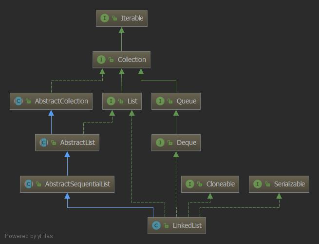

## LinkedList源码
> 内部实现是链表和数组有很多不同的地方, 但是他们也有互补的地方。

## LinkedList
### 字段以及声明

```java
public class LinkedList<E> extends AbstractSequentialList<E> implements List<E>, Deque<E>, Cloneable, java.io.Serializable {
    transient int size = 0;
    //链表头
    transient Node<E> first;
    //链表尾
    transient Node<E> last;
    private static final long serialVersionUID = 876323262645176354L;

    private static class Node<E> {
        // 数据
        E item;
        //下一个元素
        Node<E> next;
        //前一个元素
        Node<E> prev;

        Node(Node<E> prev, E element, Node<E> next) {
            this.item = element;
            this.next = next;
            this.prev = prev;
        }
    }
}
```
`AbstractList`  继承 `AbstractCollection` 实现 `List` 他们俩又继承和实现 `Collection` 和 `Iterable` 接口

<div align="center">  </div><br>

- `Iterable` 是迭代器, 实现它可以使用 `for-each` 循环, 它其中的方法定义了获取迭代器的抽象工厂方法和java8的新方法。
- `Collection` 是集合类共有的抽象, 其中也有一些默认方法, 是通用实现。
- `AbstractCollection` 是 `Collection`实现, 完善了集合通用操作。
- `List` 继承了 `Collection` 说明 `List` 属于集合类, 它定义了 `List` 集合的基本抽象。
- `AbstractList` 实现了绝大部分 `List` 的细节, 实现了迭代器, 基于内部内实现 `List` 切割功能。
- `AbstractSequentialList` 采用的是在迭代器的基础上实现的get、set、add和remove方法, 只需要实现 `listIterator` 方法和 `Iterator` 即可实现列表
- `Cloneable` 使 `List` 支持浅克隆
- `Serializable` 支持序列化, `serialVersionUID` 序列化的唯一编号
- `Deque` 双端队列的实现。

### 方法

链表不像数组创建需要连续的内存空间, 所以链表构造方法无需去指定链表的大小:

```java
public class LinkedList<E> extends AbstractSequentialList<E> implements List<E>, Deque<E>, Cloneable, java.io.Serializable {
    public LinkedList() {
    }
    public LinkedList(Collection<? extends E> c) {
        this();
        addAll(c);
    }
}    
```

**add**

- `add(E e)` 在链表的尾部添加一个节点
- `add(int index, E element)` 在指定的节点后添加一个节点
- `addAll(Collection<? extends E> c)` 把一个集合里的元素添加到链表中
- `addAll(int index, Collection<? extends E> c)` 把一个集合的元素添加到指定节点的前面
- `addFirst(E e)` 把一个元素添加链表头部
- `addLast(E e)` 把一个元素添加链表尾部

上面 `add` 的方法只要指定插入都会通过循环找到指定位置, 找位置也会判断离链表头遍历快, 还是链表尾遍历快

因为实现了 `Deque` 的原因 `LinkedList` 还可以作为无边界的 `双端队列`, `单向队列`, `栈` 来使用, 其中都有提供的方法 

## 总结
1. 不支持多线程, 支持多线程的
2. `LinkedList` 不仅仅是链表其中提供的方法还可以当作其他的数据结构来使用。
3. 它也支持 `null` 元素
4. 具体链表数据结构优缺点 [点这里](https://github.com/gitXugx/data-structure-arithmetic/blob/master/doc/datastructure/%E9%93%BE%E8%A1%A8.md)


