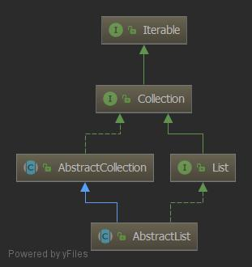
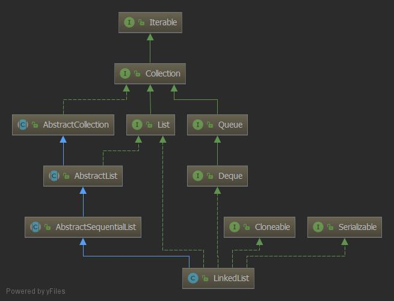

# List容器解析
> 线性表结构，可以添加重复元素有多种实现方式 `ArrayList` 、`LinkedList` 、`Vector` 等。

[toc]

## ArrayList 
> 像他的名字一样是一个数组列表, 低层组要由数组实现, 但是提供的功能比数组更强大。
### 字段以及声明

```java
public class ArrayList<E> extends AbstractList<E>
        implements List<E>, RandomAccess, Cloneable, java.io.Serializable
{
    private static final long serialVersionUID = 8683452581122892189L;
    //默认数组大小
    private static final int DEFAULT_CAPACITY = 10;
    //空数组
    private static final Object[] EMPTY_ELEMENTDATA = {};
    //默认数组, 给空数组做区分
    private static final Object[] DEFAULTCAPACITY_EMPTY_ELEMENTDATA = {};
    //最大容量
    private static final int MAX_ARRAY_SIZE = Integer.MAX_VALUE - 8;
    transient Object[] elementData; // non-private to simplify nested class access
    private int size;
}

```
从上往下开始:

`AbstractList`  继承 `AbstractCollection` 实现 `List` 他们俩又继承和实现 `Collection` 和 `Iterable` 接口

<div align="center">  </div><br>


- `Iterable` 是迭代器, 实现它可以使用 `for-each` 循环, 它其中的方法定义了获取迭代器的抽象工厂方法和java8的新方法。
- `Collection` 是集合类共有的抽象, 其中也有一些默认方法, 是通用实现。
- `AbstractCollection` 是 `Collection`实现, 完善了集合通用操作。
- `List` 继承了 `Collection` 说明 `List` 属于集合类, 它定义了 `List` 集合的基本抽象。
- `AbstractList` 实现了绝大部分 `List` 的细节, 实现了迭代器, 基于内部内实现 `List` 切割功能。
- `RandomAccess` 随机访问标识接口, 代表该类支持随机访问。 在某些情况下, `List` 可以根据该接口来判断使用最优访问方式
- `Cloneable` 使 `List` 支持浅克隆
- `Serializable` 支持序列化, `serialVersionUID` 序列化的唯一编号

### 方法

先构造方法:

```java
public class ArrayList<E> extends AbstractList<E> implements List<E>, RandomAccess, Cloneable, java.io.Serializable {
    //1.
    public ArrayList(int initialCapacity) {
        if (initialCapacity > 0) {
            this.elementData = new Object[initialCapacity];
        } else if (initialCapacity == 0) {
            this.elementData = EMPTY_ELEMENTDATA;
        } else {
            throw new IllegalArgumentException("Illegal Capacity: " + initialCapacity);
        }
    }
    //2.
    public ArrayList() {
        this.elementData = DEFAULTCAPACITY_EMPTY_ELEMENTDATA;
    }
    //3.
    public ArrayList(Collection<? extends E> c) {
        elementData = c.toArray();
        if ((size = elementData.length) != 0) {
            // c.toArray might (incorrectly) not return Object[] (see 6260652)
            if (elementData.getClass() != Object[].class)
                elementData = Arrays.copyOf(elementData, size, Object[].class);
        } else {
            // replace with empty array.
            this.elementData = EMPTY_ELEMENTDATA;
        }
    } 
}    
```

一共有3个构造方法：

- `ArrayList(int initialCapacity)` 根据容量来创建 `ArrayList` 大小。
- `ArrayList()` 创建一个默认的数组
- `ArrayList(Collection<? extends E> c)` 根据传入的数组进行一个拷贝, 该拷贝是浅拷贝。

添加方法:

```java
public class ArrayList<E> extends AbstractList<E> implements List<E>, RandomAccess, Cloneable, java.io.Serializable {
   //1.
   public boolean add(E e) {
        ensureCapacityInternal(size + 1);  // Increments modCount!!
        elementData[size++] = e;
        return true;
    }
    //2.
    public void add(int index, E element) {
        rangeCheckForAdd(index);

        ensureCapacityInternal(size + 1);  // Increments modCount!!
        System.arraycopy(elementData, index, elementData, index + 1,
                            size - index);
        elementData[index] = element;
        size++;
    }
    //3.
    public boolean addAll(Collection<? extends E> c) {
        Object[] a = c.toArray();
        int numNew = a.length;
        ensureCapacityInternal(size + numNew);  // Increments modCount
        System.arraycopy(a, 0, elementData, size, numNew);
        size += numNew;
        return numNew != 0;
    }
    //4.
   public boolean addAll(int index, Collection<? extends E> c) {
        rangeCheckForAdd(index);

        Object[] a = c.toArray();
        int numNew = a.length;
        ensureCapacityInternal(size + numNew);  // Increments modCount

        int numMoved = size - index;
        if (numMoved > 0)
            System.arraycopy(elementData, index, elementData, index + numNew,
                             numMoved);

        System.arraycopy(a, 0, elementData, index, numNew);
        size += numNew;
        return numNew != 0;
    }
}    
```

一共有4个添加元素的方法:
- `add(E e)` 在数组尾部, 直接添加一个元素, 该时间复杂度是 `O(1)`
- `add(int index, E element)` 指定位置插入元素, 最坏的情况下在数组头部添加, 该时间复杂度是 `O(n)`
- `addAll(Collection<? extends E> c)` 把一个集合添加到当前集合, 该时间复杂度是 `O(1)`
- `addAll(int index, Collection<? extends E> c)` 从指定位置添加一个集合, 最坏的情况下在数组头部添加, 该时间复杂度是 `O(n)`

**add(E e) 方法**

```java
public class ArrayList<E> extends AbstractList<E> implements List<E>, RandomAccess, Cloneable, java.io.Serializable {
    private void ensureCapacityInternal(int minCapacity) {
        ensureExplicitCapacity(calculateCapacity(elementData, minCapacity));
    }
    //1. 
    private static int calculateCapacity(Object[] elementData, int minCapacity) {
        if (elementData == DEFAULTCAPACITY_EMPTY_ELEMENTDATA) {
            return Math.max(DEFAULT_CAPACITY, minCapacity);
        }
        return minCapacity;
    }

    private void ensureExplicitCapacity(int minCapacity) {
        modCount++;

        //2. overflow-conscious code
        if (minCapacity - elementData.length > 0)
            grow(minCapacity);
    }
}
```
1. `calculateCapacity` 是计算出最小容量
2. `ensureExplicitCapacity` 根据当前数组数据所占容量和数组总容量判断是否需要扩容

扩容逻辑:

```java
public class ArrayList<E> extends AbstractList<E> implements List<E>, RandomAccess, Cloneable, java.io.Serializable {

    private void grow(int minCapacity) {
        //1. 获取数组长度
        int oldCapacity = elementData.length;
        //2. 新的数组为之前数组的1.5倍
        int newCapacity = oldCapacity + (oldCapacity >> 1);
        //3. 如果初始数组容量为0, 则直接按添加元素  
        if (newCapacity - minCapacity < 0)
            newCapacity = minCapacity;
        //4. 如果扩容的数组容量超过了最大容量时, 只赋值最大容量    
        if (newCapacity - MAX_ARRAY_SIZE > 0)
            newCapacity = hugeCapacity(minCapacity);
        //5. minCapacity is usually close to size, so this is a win:
        elementData = Arrays.copyOf(elementData, newCapacity);
    }

    private static int hugeCapacity(int minCapacity) {
        if (minCapacity < 0) // overflow
            throw new OutOfMemoryError();
        return (minCapacity > MAX_ARRAY_SIZE) ?
            Integer.MAX_VALUE :
            MAX_ARRAY_SIZE;
    }
}
```

**remove(int index) 方法**

```java
public class ArrayList<E> extends AbstractList<E> implements List<E>, RandomAccess, Cloneable, java.io.Serializable {

    public E remove(int index) {
        // 校验角标越界问题
        rangeCheck(index);

        modCount++;
        E oldValue = elementData(index);
        // 把要移除元素后面的元素整体往前移动一个
        int numMoved = size - index - 1;
        if (numMoved > 0)
            System.arraycopy(elementData, index+1, elementData, index,
                             numMoved);
        // 但是最后一个是copy之前的数据, 所以要置null                     
        elementData[--size] = null; // clear to let GC do its work

        return oldValue;
    }
}
```
- 移除元素在数组尾部时, 时间复杂度为 `O(1)`
- 移除元素最坏的情况下, 时间复杂度为 `O(n)`, 因为要做数据copy
- 他不会改变数组大小。

**trimToSize() 方法**

```java
public class ArrayList<E> extends AbstractList<E> implements List<E>, RandomAccess, Cloneable, java.io.Serializable {

    public void trimToSize() {
        modCount++;
        if (size < elementData.length) {
            // 如果size == 0 就给空元素数组, 如果size >0 就把数组大小改成 size 大小
            elementData = (size == 0) ? EMPTY_ELEMENTDATA : Arrays.copyOf(elementData, size);
        }
    }
}
```

- `trimToSize` 方法会改变数组的大小。

## Vector

### 方法
它的实现和 `ArrayList` 基本一致, 但是 `Vector` 每个对外方法都加上了 `synchronized` 关键字来是实现线程安全。
还有就是扩容方法有点不同: 
```java
public class Vector<E> extends AbstractList<E> implements List<E>, RandomAccess, Cloneable, java.io.Serializable {
    private void grow(int minCapacity) {
        // overflow-conscious code
        int oldCapacity = elementData.length;
        int newCapacity = oldCapacity + ((capacityIncrement > 0) ?
                                         capacityIncrement : oldCapacity);
        if (newCapacity - minCapacity < 0)
            newCapacity = minCapacity;
        if (newCapacity - MAX_ARRAY_SIZE > 0)
            newCapacity = hugeCapacity(minCapacity);
        elementData = Arrays.copyOf(elementData, newCapacity);
    }
}
```
`Vector` 每次扩容为当前的1倍, 如果想让线程不安全的 `ArrayList` 变成线程安全的也可以使用 `Collections.synchronizedList()`。
```java
public class Collections {
   public static <T> List<T> synchronizedList(List<T> list) {
        return (list instanceof RandomAccess ?
                new SynchronizedRandomAccessList<>(list) :
                new SynchronizedList<>(list));
    }
}
```
`SynchronizedList` 的实现是典型的装饰着模式, 使 `ArrayList` 具有线程安全的功能, 里面值得注意的 `SynchronizedList` 使用的锁是 当前`list` 对象

```java
  static class SynchronizedCollection<E> implements Collection<E>, Serializable {
        private static final long serialVersionUID = 3053995032091335093L;

        final Collection<E> c;  // Backing Collection
        final Object mutex;     // Object on which to synchronize

        SynchronizedCollection(Collection<E> c) {
            this.c = Objects.requireNonNull(c);
            // 当前对象
            mutex = this;
        }
  }
```

### 总结

1. `ArrayList` 适合的场景: 当你删除插入操作比较少 (尾部操作更快), 随机访问多
2. `ArrayList` 不适合多线程场景, 但是可以使用 `Collections.synchronizedList()` 来保证 `List` 接口的方法都是线程安全的
3. `Vector` 是关键字 `synchronized` 的同步, 其他实现基本和 `ArrayList` 一样
4. 都支持 `fail-fast` 以防在`并发修改时`发生不必要的异常
5. 支持对 `null` 元素操作
6. 具体数组数据结构优缺点 [点这里](https://github.com/gitXugx/data-structure-arithmetic/blob/master/doc/datastructure/%E6%95%B0%E7%BB%84.md)


## LinkedList
> 内部实现是链表和数组有很多不同的地方, 但是他们也有互补的地方。


### 字段以及声明

```java
public class LinkedList<E> extends AbstractSequentialList<E> implements List<E>, Deque<E>, Cloneable, java.io.Serializable {
    transient int size = 0;
    //链表头
    transient Node<E> first;
    //链表尾
    transient Node<E> last;
    private static final long serialVersionUID = 876323262645176354L;

    private static class Node<E> {
        // 数据
        E item;
        //下一个元素
        Node<E> next;
        //前一个元素
        Node<E> prev;

        Node(Node<E> prev, E element, Node<E> next) {
            this.item = element;
            this.next = next;
            this.prev = prev;
        }
    }
}
```
`AbstractList`  继承 `AbstractCollection` 实现 `List` 他们俩又继承和实现 `Collection` 和 `Iterable` 接口

<div align="center">  </div><br>

- `Iterable` 是迭代器, 实现它可以使用 `for-each` 循环, 它其中的方法定义了获取迭代器的抽象工厂方法和java8的新方法。
- `Collection` 是集合类共有的抽象, 其中也有一些默认方法, 是通用实现。
- `AbstractCollection` 是 `Collection`实现, 完善了集合通用操作。
- `List` 继承了 `Collection` 说明 `List` 属于集合类, 它定义了 `List` 集合的基本抽象。
- `AbstractList` 实现了绝大部分 `List` 的细节, 实现了迭代器, 基于内部内实现 `List` 切割功能。
- `AbstractSequentialList` 采用的是在迭代器的基础上实现的get、set、add和remove方法, 只需要实现 `listIterator` 方法和 `Iterator` 即可实现列表
- `Cloneable` 使 `List` 支持浅克隆
- `Serializable` 支持序列化, `serialVersionUID` 序列化的唯一编号
- `Deque` 双端队列的实现。

### 方法

链表不像数组创建需要连续的内存空间, 所以链表构造方法无需去指定链表的大小:

```java
public class LinkedList<E> extends AbstractSequentialList<E> implements List<E>, Deque<E>, Cloneable, java.io.Serializable {
    public LinkedList() {
    }
    public LinkedList(Collection<? extends E> c) {
        this();
        addAll(c);
    }
}    
```

**add**

- `add(E e)` 在链表的尾部添加一个节点
- `add(int index, E element)` 在指定的节点后添加一个节点
- `addAll(Collection<? extends E> c)` 把一个集合里的元素添加到链表中
- `addAll(int index, Collection<? extends E> c)` 把一个集合的元素添加到指定节点的前面
- `addFirst(E e)` 把一个元素添加链表头部
- `addLast(E e)` 把一个元素添加链表尾部

上面 `add` 的方法只要指定插入都会通过循环找到指定位置, 找位置也会判断离链表头遍历快, 还是链表尾遍历快

因为实现了 `Deque` 的原因 `LinkedList` 还可以作为无边界的 `双端队列`, `单向队列`, `栈` 来使用, 其中都有提供的方法 

### 总结
1. 不支持多线程, 支持多线程的
2. `LinkedList` 不仅仅是链表其中提供的方法还可以当作其他的数据结构来使用。
3. 它也支持 `null` 元素
4. 具体链表数据结构优缺点 [点这里](https://github.com/gitXugx/data-structure-arithmetic/blob/master/doc/datastructure/%E9%93%BE%E8%A1%A8.md)

